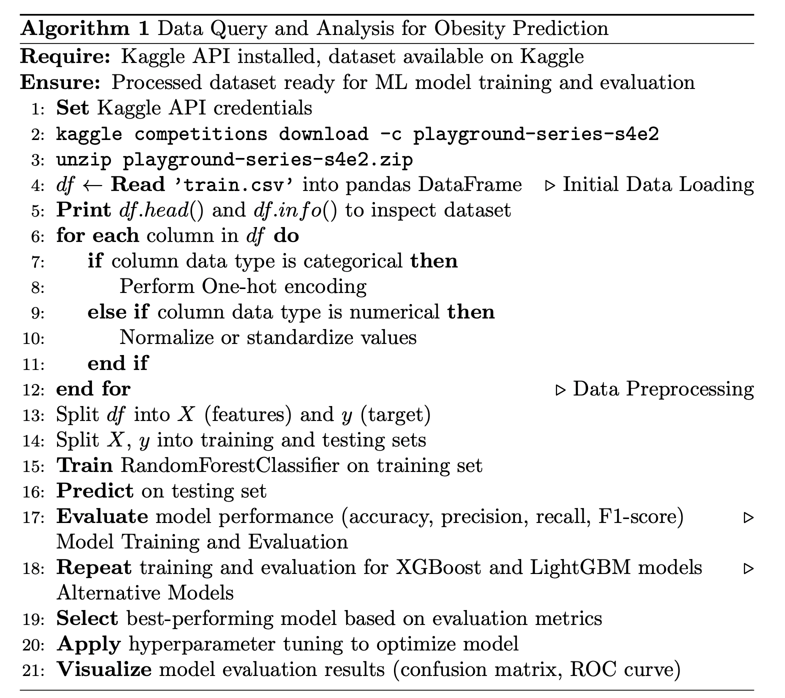

# Data Query and Analysis

## Data Query

### Overview
The process involves programmatically accessing the Multi-Class Prediction of Obesity Risk dataset from Kaggle. This dataset is instrumental for predicting obesity levels based on a multitude of factors, including but not limited to dietary habits, physical activities, and genetic predispositions.

### Data Query Process

#### Preliminary Steps
- Installation of necessary libraries such as pandas for data manipulation, and the Kaggle API for dataset retrieval.
- Configuration of environment variables with Kaggle API credentials for secure dataset access.

#### Query Process
- Execution of Kaggle API commands to download the specified dataset.
- Decompression and extraction of the dataset from its zip file.
- Loading of the dataset into a pandas DataFrame for initial data exploration and preprocessing.
- Inspection and preprocessing steps include identifying missing values, understanding data types, and performing initial data cleaning.
- Storage of the cleaned dataset in a format (e.g., CSV) suitable for further analysis and model training.

### Rationale for Dataset Usage
This dataset offers a rich, multidimensional view into the factors affecting obesity, providing a solid foundation for building predictive models. It's selected for its relevance to health informatics, offering insights into obesity prediction that can inform healthcare strategies and interventions.

## Data Analysis

### Machine Learning Model Application and Evaluation

#### Model Development
- Splitting of the dataset into training and testing sets to ensure model evaluation under realistic conditions.
- Application of feature engineering techniques to enhance model performance, including one-hot encoding for categorical variables and normalization for numerical variables.
- Training of machine learning models, specifically RandomForestClassifier, XGBoost, and LightGBM, chosen for their ability to handle both categorical and numerical data efficiently.

#### Model Evaluation
- Evaluation of model performance using metrics such as accuracy, precision, recall, and F1-score.
- Utilization of confusion matrices and ROC curves to provide insights into model effectiveness in classifying obesity levels.
- Iterative model refinement through hyperparameter tuning and cross-validation techniques to maximize predictive performance.

## Reference
- Kaggle's Multi-Class Prediction of Obesity Risk Dataset. Accessed: [Obesity Risk Dataset](https://www.kaggle.com/competitions/playground-series-s4e2/data)

## Pseudo-Code for Data Query Process



### Pseudo-Code for Data Analysis Process

```latex
\begin{algorithm}
\caption{Data Query and Analysis for Obesity Prediction}\label{alg:obesity_pred}
\begin{algorithmic}[1]

\Require Kaggle API installed, dataset available on Kaggle
\Ensure Processed dataset ready for ML model training and evaluation

\State \textbf{Set} Kaggle API credentials
\State \texttt{kaggle competitions download -c playground-series-s4e2}
\State \texttt{unzip playground-series-s4e2.zip}

\State $df \gets$ \textbf{Read} \texttt{'train.csv'} into pandas DataFrame
\Comment{Initial Data Loading}
\State \textbf{Print} $df.head()$ and $df.info()$ to inspect dataset

\For{\textbf{each} column in $df$}
    \If{column data type is categorical}
        \State Perform One-hot encoding
    \ElsIf{column data type is numerical}
        \State Normalize or standardize values
    \EndIf
\EndFor
\Comment{Data Preprocessing}

\State Split $df$ into $X$ (features) and $y$ (target)
\State Split $X$, $y$ into training and testing sets

\State \textbf{Train} RandomForestClassifier on training set
\State \textbf{Predict} on testing set
\State \textbf{Evaluate} model performance (accuracy, precision, recall, F1-score)
\Comment{Model Training and Evaluation}

\State \textbf{Repeat} training and evaluation for XGBoost and LightGBM models
\Comment{Alternative Models}

\State \textbf{Select} best-performing model based on evaluation metrics
\State \textbf{Apply} hyperparameter tuning to optimize model
\State \textbf{Visualize} model evaluation results (confusion matrix, ROC curve)

\end{algorithmic}
\end{algorithm}

\end{document}
