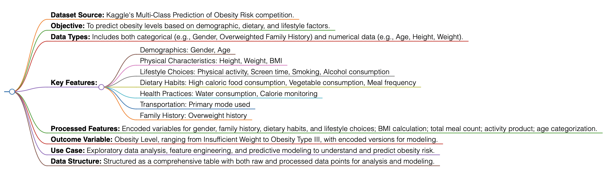

# Data Description

This dataset is part of the Kaggle competition "Multi-Class Prediction of Obesity Risk" and is aimed at predicting obesity levels in individuals based on a variety of factors. The dataset covers demographics, dietary habits, physical activity, and lifestyle choices among others, to provide a comprehensive overview of factors contributing to obesity. The data includes information such as gender, age, height, weight, family history of obesity, eating habits, physical activity levels, and more, making it a valuable resource for understanding and analyzing obesity trends and influences.

## Dataset Features

The dataset includes the following features, providing a detailed insight into each participant's lifestyle and health status:

- **id:** Unique identifier for the participant.
- **Gender:** The gender of the participant (Male/Female).
- **Age:** The age of the participant.
- **Height:** The height of the participant in meters.
- **Weight:** The weight of the participant in kilograms.
- **Overweighted Family History:** Indicates if there is a history of overweight in the family (Yes/No).
- **High caloric food consp:** Indicates if the participant consumes high caloric food frequently (Yes/No).
- **veg consp:** The frequency of vegetable consumption.
- **main meal consp:** The average number of main meals per day.
- **Food btw meal consp:** The frequency of eating between meals.
- **SMOKE:** Indicates if the participant smokes (Yes/No).
- **Water consp:** The average daily water consumption in liters.
- **Calories Monitoring:** Indicates if the participant monitors their calorie intake (Yes/No).
- **physical actv:** The frequency of physical activity per week.
- **Screentime:** The average daily screen time in hours.
- **Alcohol consp:** The frequency of alcohol consumption.
- **transport used:** The primary mode of transportation used by the participant.
- **Obesity_Level:** The obesity level category.
- **Encdd_Obesity_Level:** Encoded obesity level.
- **Encdd_transport_used:** Encoded primary mode of transportation.
- **Encdd_Alcohol_consp:** Encoded frequency of alcohol consumption.
- **Encdd_Food_btw_meal:** Encoded frequency of eating between meals.
- **Encoded_Gender, Encoded_Family_History, Encoded_High_Caloric, Encoded_Smoke, Encoded_Calories_Monitoring:** Binary encoded variables for respective categories.
- **BMI:** Calculated Body Mass Index.
- **Meal:** Total count of meals consumed per day, including snacks.
- **Activity:** Product of physical activity frequency and screen time.
- **IsYoung, IsAging:** Binary indicators for age groups.

## Data Types

The dataset is a mix of categorical and numerical data, offering a holistic view of the factors that contribute to obesity.

## Data Structure

The dataset is structured for complex analysis, allowing for both direct obesity level classification and exploratory data analysis to uncover underlying patterns or correlations.

## Sample Data

| id | Gender | Age | Height | Weight | Overweighted Family History | High caloric food consp | ... | BMI  | Meal | Activity | IsYoung | IsAging |
|----|--------|-----|--------|--------|-----------------------------|-------------------------|-----|------|------|----------|---------|--------|
| 0  | Male   | 24  | 1.70   | 81     | Yes                         | Yes                     | ... | 28.03| 3.32 | 0        | TRUE    | FALSE  |
| 1  | Female | 18  | 1.56   | 57     | Yes                         | Yes                     | ... | 23.42| 3.67 | 1        | TRUE    | FALSE  |
| 2  | Female | 18  | 1.71   | 50     | Yes                         | Yes                     | ... | 17.07| 1.75 | 1.45     | TRUE    | FALSE  |

# Flowchart of Dataset Structure


# Reference

- Multi-Class Prediction of Obesity Risk. Kaggle. [https://www.kaggle.com/competitions/playground-series-s4e2/data](https://www.kaggle.com/competitions/playground-series-s4e2/data).

```bibtex
@online{KaggleObesityRisk2023,
  title={Multi-Class Prediction of Obesity Risk},
  year={2023},
  url={https://www.kaggle.com/competitions/playground-series-s4e2/data}
}

