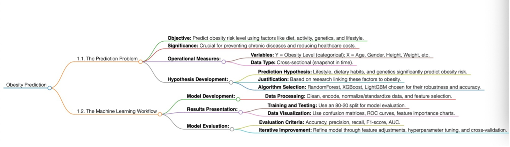

# 1.1. The Prediction Problem
## Research Question Formulation:
- How can machine learning models be effectively utilized to predict obesity risk levels based on a range of features? 

- Which are the most important features used to predict obesity risk?

- Significance: Understanding and predicting obesity risk is critical because it is linked to a number of chronic diseases, including diabetes, heart disease, and some malignancies (Robin, 2007). Early prediction can help with preventive actions and personalized healthcare interventions, lowering the overall healthcare burden.

## Operational Measures

- Variables:
-- Dependent (Y) Variable: Obesity Level (Categorical: from Insufficient Weight to Obesity Type III)
-- Independent (X) Variables: Age, Gender, Height, Weight, Family History of Overweight, Food Consumption Habits, Physical Activity Level, Water Consumption, Screen Time, Transport Used, etc.
-	Data Type: The dataset appears to be cross-sectional, as it captures information from individuals at a single point in time without tracking changes over time.
## Hypothesis Development
-	Prediction Hypothesis: It is hypothesized that lifestyle and dietary habits (e.g., high caloric food consumption, physical inactivity, low water intake), along with genetic predispositions (e.g., family history of overweight), significantly predict the risk level of obesity (Marti et al., 2004).
-	Justification: This hypothesis is based on existing research that identifies these factors as key contributors to obesity. Their quantifiable measures can provide insights into the likelihood of an individual falling into a certain obesity category.
-	Machine Learning Algorithm Selection: For this prediction problem, ensemble methods like Random Forest, LightGBM, and XGBoost are chosen due to their ability to handle categorical and numerical data, manage overfitting, and improve prediction accuracy through multiple decision trees.

# 1.2.The Machine Learning Workflow
## Model Development
-	Data Processing: The approach entails cleaning the data, managing any missing values, encoding categorical variables, normalizing/standardizing numerical variables as needed, and developing new features (e.g., BMI) that may improve the model's predictive capability. Feature selection will be used to determine the most important indicators for predicting obesity risk.

## Methodolody
-	The methodology of our study revolves around employing ensemble machine learning techniques—specifically, Random Forest, LightGBM, and XGBoost—to predict obesity risk levels from a comprehensive dataset that encapsulates various features, including nutrition, physical activity, genetic predispositions, and lifestyle choices.  The dataset undergoes rigorous preprocessing to ensure its suitability for analysis, including data cleaning, feature encoding, and normalization.  A significant aspect of our approach is the use of feature selection methods to identify the most impactful predictors of obesity risk.  The models are trained on 80% of the data and validated on the remaining 20% to evaluate their performance using metrics such as accuracy, precision, recall, F1-score, and the area under the ROC curve (AUC). This methodology not only aims to ascertain the effectiveness of machine learning models in predicting obesity risk levels but also seeks to uncover which features hold the most predictive power in determining obesity risk.

## Results Presentation
-	Training and Testing: The dataset will be split into a training set (80%) and a testing set (20%). The model's performance will be evaluated on the testing set after being trained on the training set.
- Data Visualization: Visualization tools such as confusion matrices, ROC curves, and feature significance charts will be used to display the findings. These strategies are effective at communicating the model's performance and the impact of various variables on prediction.
## Model Evaluation
-	Evaluation Criteria: The model's performance will be evaluated using accuracy, precision, recall, F1-score, and area under the ROC curve (AUC). These metrics are suitable for evaluating classification models and will provide a comprehensive understanding of the model's predictive power.
-	Iterative Improvement: The model will undergo an iterative refinement process, where features may be added or removed, hyper-parameters tuned, and different algorithms tested to enhance predictive accuracy. Cross-validation will be used to ensure the model's robustness and generalizability.

## Flowchart of Method 
 

## References
- Roblin, L. (2007). Childhood obesity: food, nutrient, and eating-habit trends and influences. Applied Physiology, Nutrition, and Metabolism, 32(4), 635-645.
- Marti, A., Moreno-Aliaga, M. J., Hebebrand, J., & Martinesz, J. A. (2004). Genes, lifestyles and obesity. International Journal of Obesity, 28(3), S29-S36.

